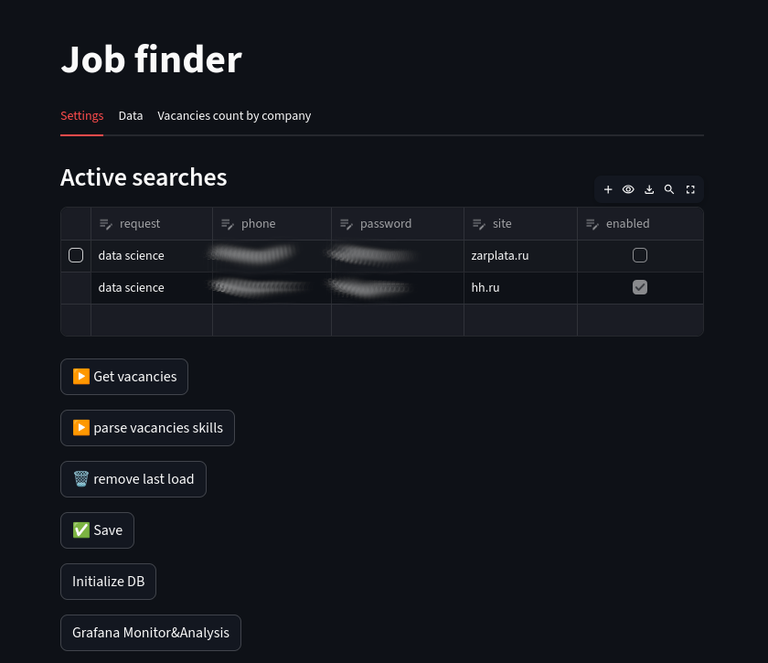
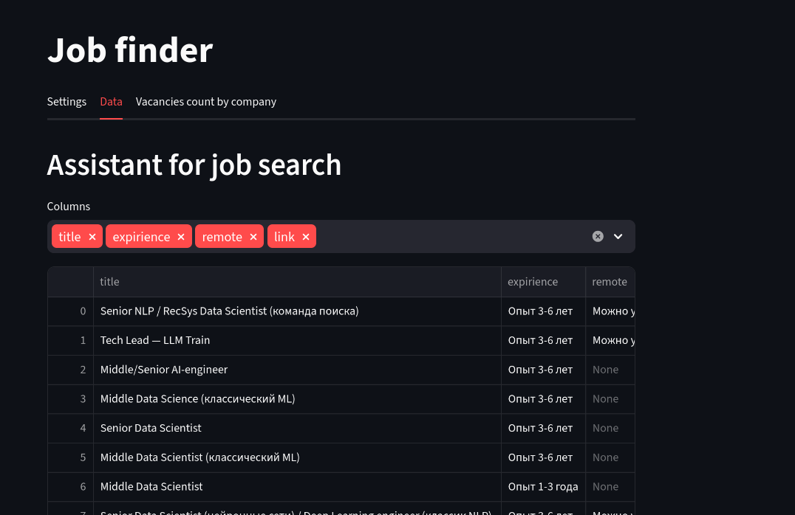
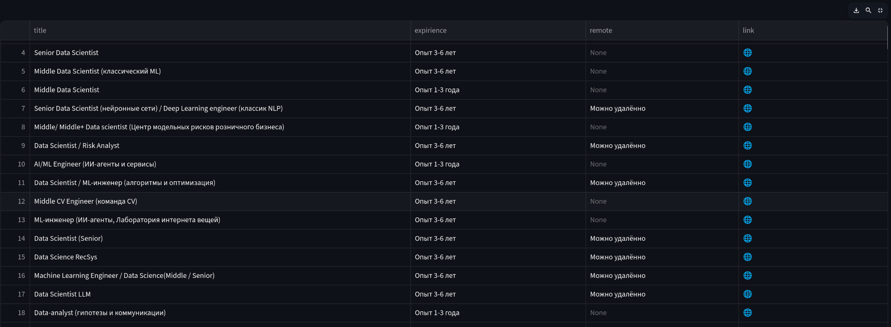
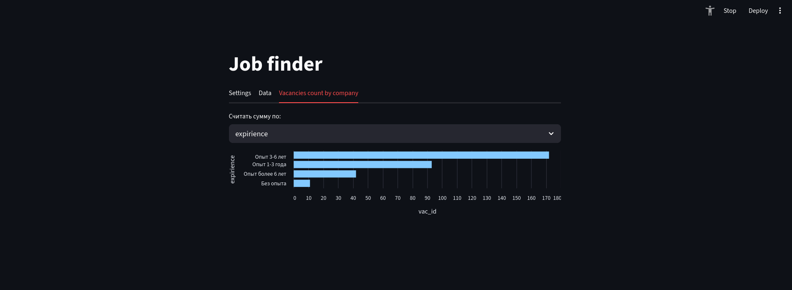
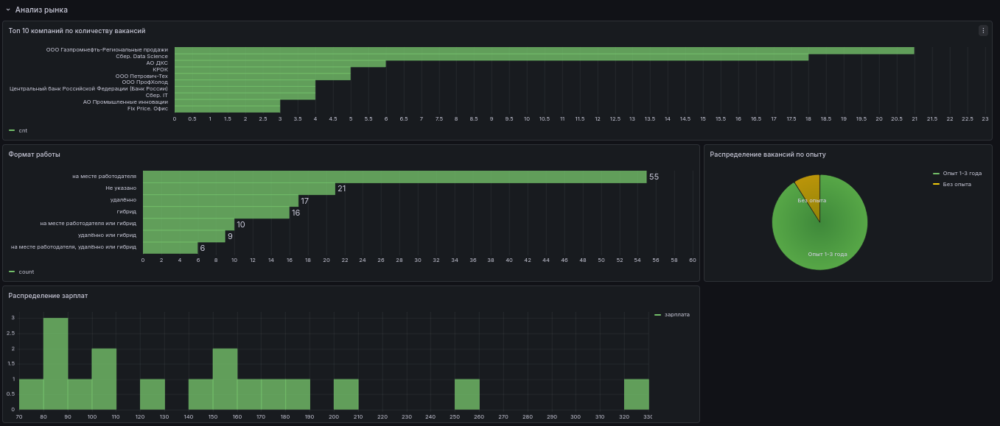
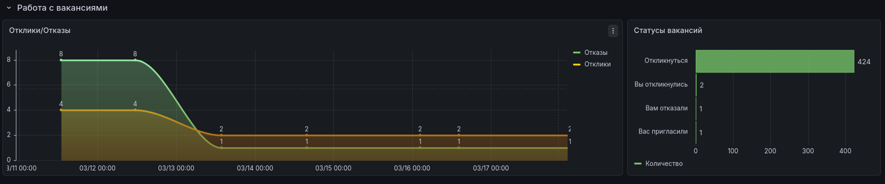
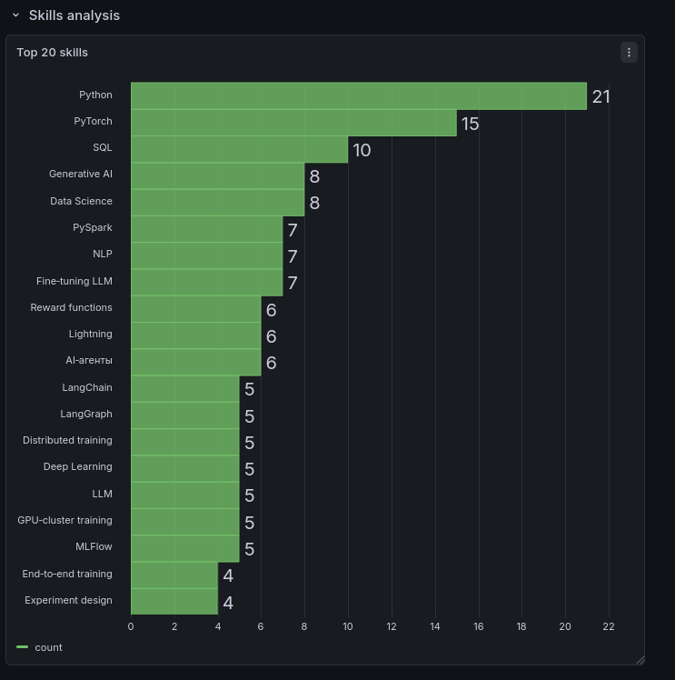
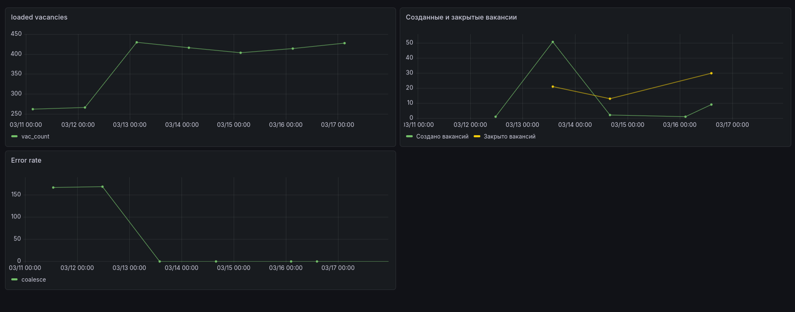

[Русская версия](README.ru.md)

# Job assistant

## Goals
  - Market analysis (vacancy count, main companies, job parameters)
  - Find and respond to vacancies
  - Vacancies skills analysis
  - Automatic vacancies matching/responsing (TBD)

## Supported sites
  - hh.ru
  - zarplata.ru
  - superjob.ru (TBD)

## System requirements

OS Linux with docker-compose and git installed.

## Installation

1) clone repo

```
git clone https://github.com/serser152/hh.ru_job_finder
cd hh.ru_job_finder
docker-compose build
docker-compose up -d
```


Configure .env variables

UI - [http://localhost:8501](http://localhost:8501)
grafana interface - [http://localhost:3000](http://localhost:3000)
Import grafana dashboards from "grafana_dashboards" folder.

2) Configure password access on sites. Make a test search via site web-interface.
3) Enter the UI settings tab and add grab request.


## Architecture

Service implemented via docker containers. There are following containers:
- postgresql
- grafana
- hh_grubber (selenium)
- gui (streamlit + celery)
- redis (for celery)
- rabbitmq (for celery)
- description_analyser (langchain/openrouter/ollama)
## Examples

### UI

#### Settings tab

#### data tab


table in fullscreen mode

#### count bar chart 


### Grafana charts

#### Markert overview




#### skill analysis


#### System monitoring

